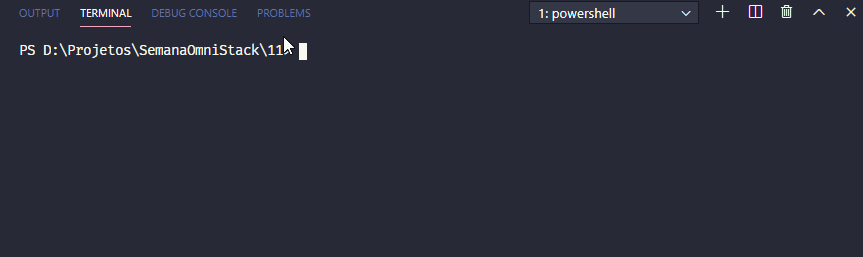
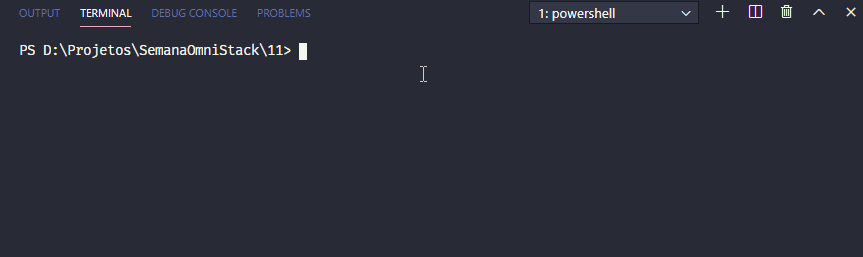
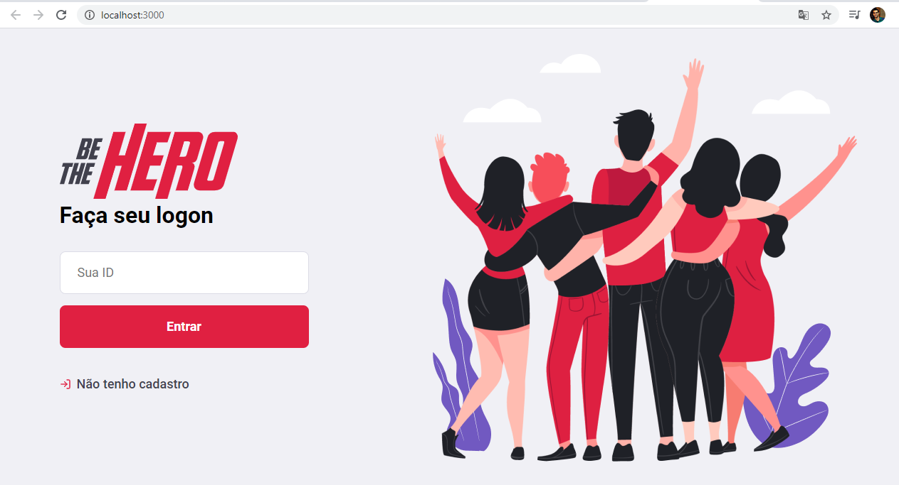
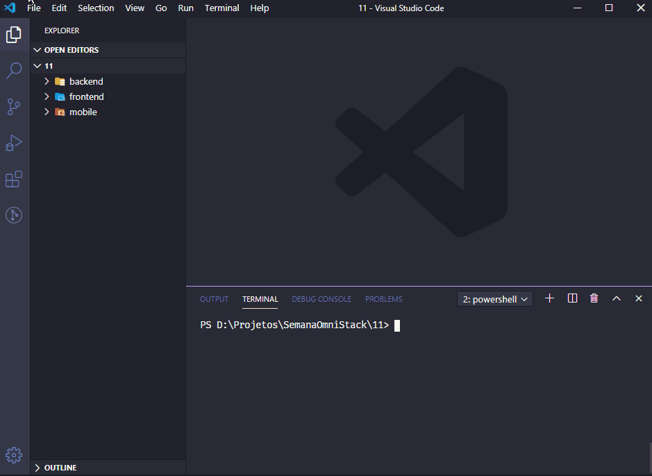

# Be the Hero
### Semana Omni Stack 11

Este projeto teve como objeto o desenvolvimento de um ecossistema focado na stack JavaScript, com o node.js, React.js e ReactNative.
Dependências principais: Node, React, ReactNative, Express, Knex, Celebrate, Supertest.

## Funcionalidades
> Web
* Cadastrar ONG'S
* Cadastrar novos casos
* Listar casos cadastrados
* Excluir casos cadastrados
> App
* Listar todos os casos disponíveis
* Entrar em contato por WhatsApp do caso de interesse
* Entrar em contato por E-mail do caso de interesse

O Objetivo principal deste projeto é disponibilizar uma área Web onde é possível as ONG's se cadastrarem e criarem os casos que irão necessitar de ajuda da comunidade. 
Os interessados em ajudar, nossos heróis, terão a seu dispor um App para listar os casos disponíveis e entrarem em contato através do WhatsApp ou E-mail, afim de ajudar a ONG escolhida a combater aquele caso selecionado.

## Dicas de instalação
Após clonar o projeto em seu computador, os serviços estarão rodando nas portas padrões, sendo:

* **Backend** : 3333
* **Frontend** : 3000

Para rodar o backend, acesse o seu terminal, navegue até a pasta backend e execute o comando: **npm start**

Para rodar o frontend, acesse o seu terminal, navegue até a pasta frontend e execute o comando: **npm star**

Automaticamente será aberto em seu navegador padrão com o sistema funcionando:

Até aqui já é possível que as ONG's se cadastrem e insiram os casos que necessitarão de ajuda, além de ser possível realizar a exclusão dos casos encerrados.

Para rodar o aplicativo é necessário que o ambiente do React native esteja configurado em sua máquina. Também é necessário que você já esteja com o emulador aberto ou o celular conectado ao computador através do cabo USB.
Antes de iniciar a instalação do aplicativo é necessário alterar um arquivo para que a aplicação encontre o nosso backend, para isso:

* Descubra qual é o endereço IP do seu computador.
* Edite o arquivo disponível em: *mobile-> src-> services -> api.js*.
* Substitua o IP 192.168.0.188 pelo IP do seu computador.

>Esta alteração é necessária para rodar o aplicativo utilizando o seu computador como servidor, porque neste caso o **localhost** não funcionaria.

Pronto.
Para rodar o aplicativo, acesse o seu terminal, navegue até a pasta mobile e execute o comando: **npx react-native run-android**

